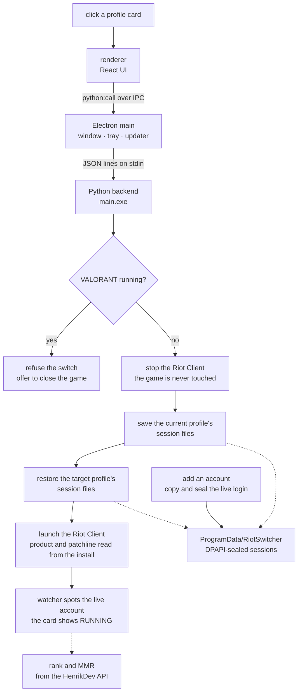
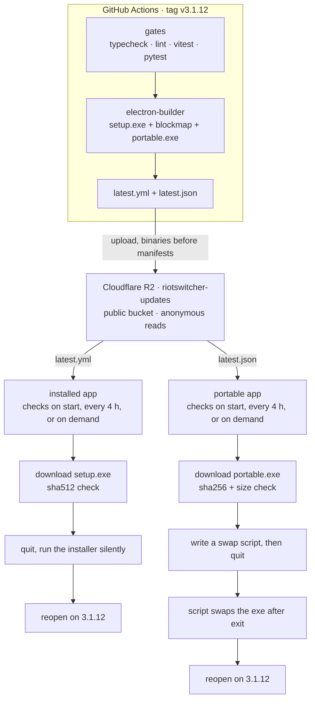
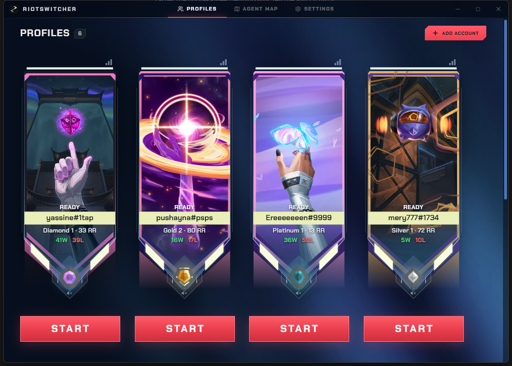

# RiotSwitcher

## How it works

```mermaid
flowchart TD
  A["click a profile card"] --> B["renderer<br/>React UI"]
  B -->|"python:call over IPC"| C["Electron main<br/>window · tray · updater"]
  C -->|"JSON lines on stdin"| D["Python backend<br/>main.exe"]

  D --> E{"VALORANT running?"}
  E -->|"yes"| F["refuse the switch<br/>offer to close the game"]
  E -->|"no"| G["stop the Riot Client<br/>the game is never touched"]
  G --> H["save the current profile's<br/>session files"]
  H --> I["restore the target profile's<br/>session files"]
  I --> J["launch the Riot Client<br/>product and patchline read from the install"]
  J --> K["watcher spots the live account<br/>the card shows RUNNING"]

  L["add an account<br/>copy and seal the live login"] --> P["ProgramData/RiotSwitcher<br/>DPAPI-sealed sessions"]
  H -.-> P
  I -.-> P
  K -.-> Q["rank and MMR<br/>from the HenrikDev API"]
```

## How updates work

```mermaid
flowchart TD
  subgraph REL["GitHub Actions · tag v3.1.12"]
    A1["gates<br/>typecheck · lint · vitest · pytest"] --> A2["electron-builder<br/>setup.exe + blockmap + portable.exe"]
    A2 --> A3["latest.yml + latest.json"]
  end

  A3 -->|"upload, binaries before manifests"| R2["Cloudflare R2 · riotswitcher-updates<br/>public bucket · anonymous reads"]

  R2 -->|"latest.yml"| I0["installed app<br/>checks on start, every 4 h, or on demand"]
  R2 -->|"latest.json"| P0["portable app<br/>checks on start, every 4 h, or on demand"]

  I0 --> I1["download setup.exe<br/>sha512 check"] --> I2["quit, run the installer silently"] --> I3["reopen on 3.1.12"]
  P0 --> P1["download portable.exe<br/>sha256 + size check"] --> P2["write a swap script, then quit"] --> P3["script swaps the exe after exit"] --> P4["reopen on 3.1.12"]
```

